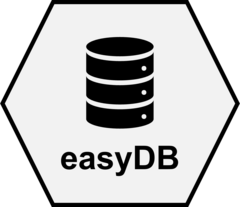

<!-- README.md is generated from README.Rmd. Please edit that file -->

```{r, include = FALSE}
knitr::opts_chunk$set(
  collapse = TRUE,
  comment = "#>",
  fig.path = "man/figures/README-",
  out.width = "100%"
)
```

# easydb <a href="https://selkamand.github.io/easydb/"></a>

<!-- badges: start -->

[](https://lifecycle.r-lib.org/articles/stages.html#experimental)

<!-- badges: end -->

The goal of easydb is to simplify the process of connecting to databases using R

## Installation

Install from CRAN

``` r
install.packages('easydb')
```

You can install the development version of easydb like so:

``` r
# install.packages('remotes')
remotes::install_github('selkamand/easydb')
```

## Connecting to a database

### Functions

Connect to databases:

`easydb_connect('database_name')`

Disconnect from databases:

`easydb_disconnect(connection)`

### What to expect

The first time you try to connect to a database, you may have to answer some questions about the database (depending on the database type you're connecting to).

Once you've setup the configuration, you will not have to re-enter host/port/creds unless you set the argument `from_scratch = TRUE`. This argument will delete the existing configuration and credentials for the given database and prompt you to supply updated information.

## Quick start

```{r sqlite, eval=FALSE}
library(easydb)

# sqlite
sqlitedb <- system.file(package="easydb", "testdbs/mtcars.sqlite")
sqlite_connection <- easydb_connect(sqlitedb)

# mysql
# Example: connect to the public rfam mysql database
#
# See here for connection configuration: 
# https://docs.rfam.org/en/latest/database.html
rfam_connection <- easydb_connect(dbname = "Rfam")


# postgresql
# Example: Connect to public RNAcentral postgres database
#
# See here for connection configuration: 
# https://rnacentral.org/help/public-database
rna_central_connection <- easydb_connect(dbname = 'pfmegrnargs')


# Don't forget to disconnect from databases when you finish!
easydb_disconnect(sqlite_connection)
easydb_disconnect(rna_central_connection)
easydb_disconnect(rfam_connection)
```

## Disconnect

Once you've finished working with a database, its best to disconnect from the db using `easydb_disconnect(connection_object)`

# How does easydb work?

Database configurations (host, port, driver, etc) are stored in a configuration file that will be created at \~/.easydb or some custom user-specified location.

Credentials are stored separately in your operating systems credential store. This is powered by `keyring`. If you're on linux you may need to install the secret service library. See the [readme](https://github.com/r-lib/keyring) for details
